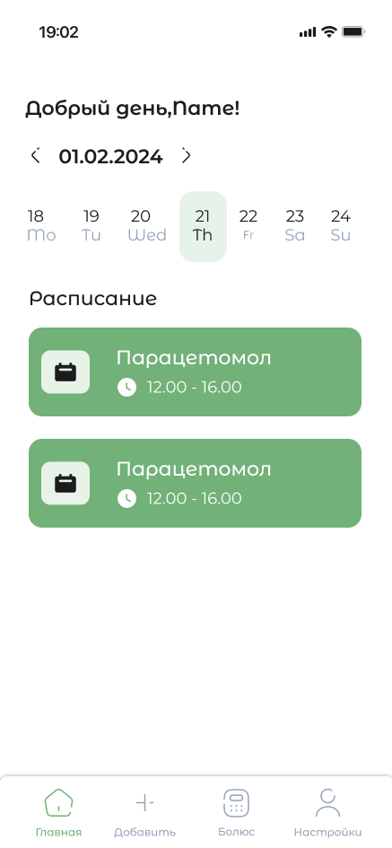
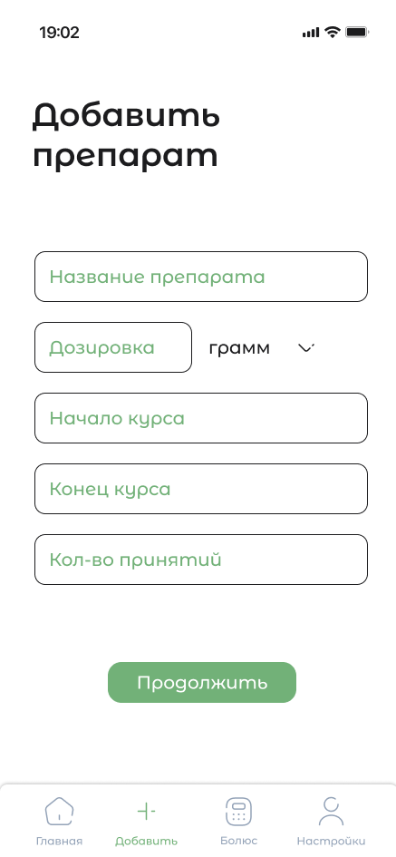
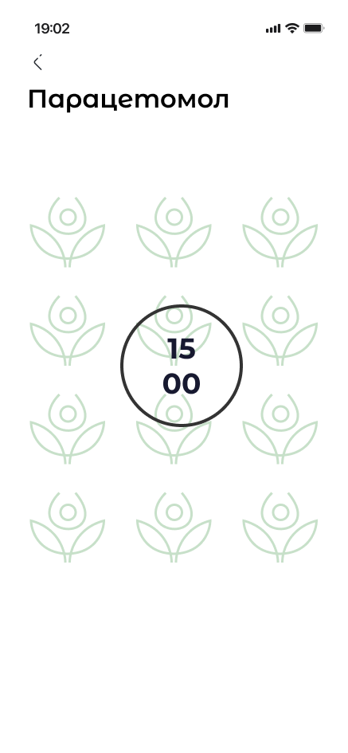
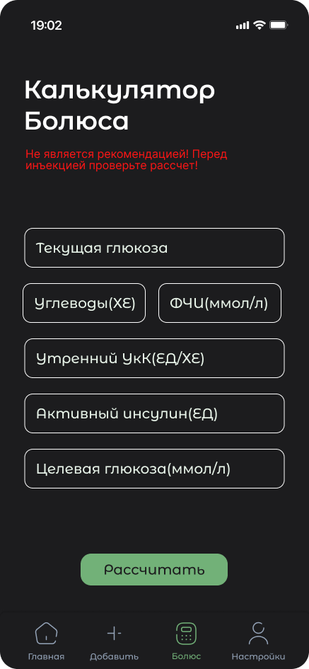

  
  
  # 💊 Medicine Reminder
  
  > Умный помощник для контроля приёма лекарств и управления курсами лечения

  
  
  
  

---

## 📱 Screenshots

### 🌿 Light Theme

<table>
  <tr>
    <td align="center">
      
       
      <b>Главный экран</b>
       
      Расписание приёма на день
    </td>
    <td align="center">
      
       
      <b>Добавить препарат</b>
       
      Настройка курса лечения
    </td>
    <td align="center">
      
       
      <b>Напоминание</b>
       
      Кастомный Alarm Service
    </td>
  </tr>
</table>

### 🌙 Dark Theme

<table>
  <tr>
    <td align="center">
      
       
      <b>Калькулятор болюса</b>
       
      Расчёт дозы инсулина
    </td>
  </tr>
</table>

---

## ✨ Возможности

**💊 Управление препаратами** — добавляй лекарства с дозировкой, датами начала и конца курса, кратностью приёма

**🔔 Кастомный Alarm Service** — собственная система уведомлений, работающая независимо от стандартных push-уведомлений Android, гарантирует точность напоминаний

**📅 Расписание на день** — удобный календарь с навигацией по дням и визуальным расписанием всех приёмов

**🧮 Калькулятор болюса** — расчёт дозы инсулина по текущей глюкозе, углеводам, ФЧИ, УкК и активному инсулину

**🎨 Тёмная и светлая тема** — полная поддержка обоих режимов отображения

---

## 🛠 Tech Stack

| Слой | Технологии |
|------|-----------|
| **Language** | Kotlin / Java |
| **UI** | XML + адаптивная вёрстка |
| **Database** | Firebase |
| **Notifications** | Кастомный Alarm Service |
| **Architecture** | Android Native |

---

## ⚠️ Дисклеймер

> Калькулятор болюса **не является медицинской рекомендацией**. Перед любой инъекцией инсулина проверяйте расчёт с лечащим врачом.

---

Made with 🌿 by [a4ifka](https://github.com/a4ifka)

